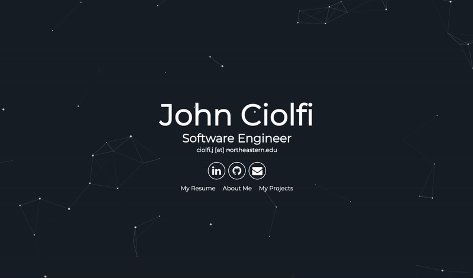

# jciolfi.github.io

Welcome to my website. I've used this to showcase some of my projects. Please check it out live [here](https://jciolfi.github.io). Please feel free to reach me at ciolfi.j \[at\] northeastern.edu.

  

# Credits

This is a cloned and modified version of the particle theme from [nrandecker](https://github.com/nrandecker/particle.git). Improvements include reading from a standardized JSON format instead of hardcoding, opening up the potential to serve other users' sites as a remote Jekyll theme. I haven't received any interest for this yet, so I will keep the remote theme private for now.

